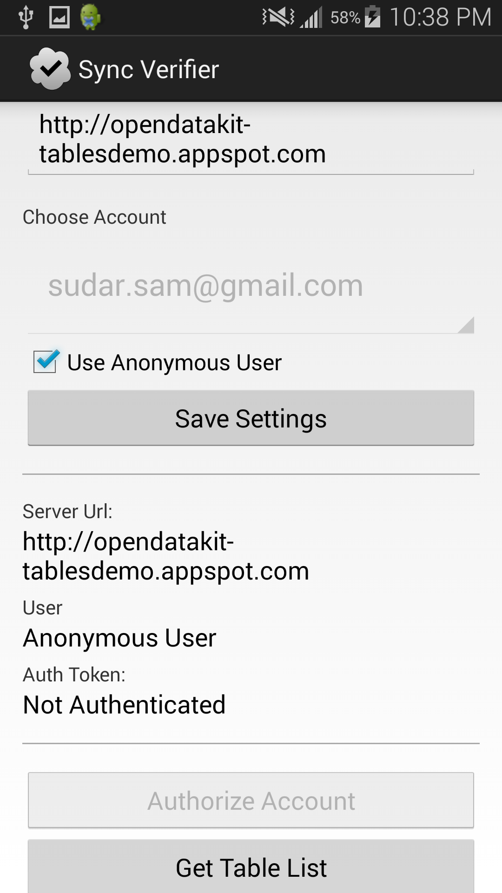
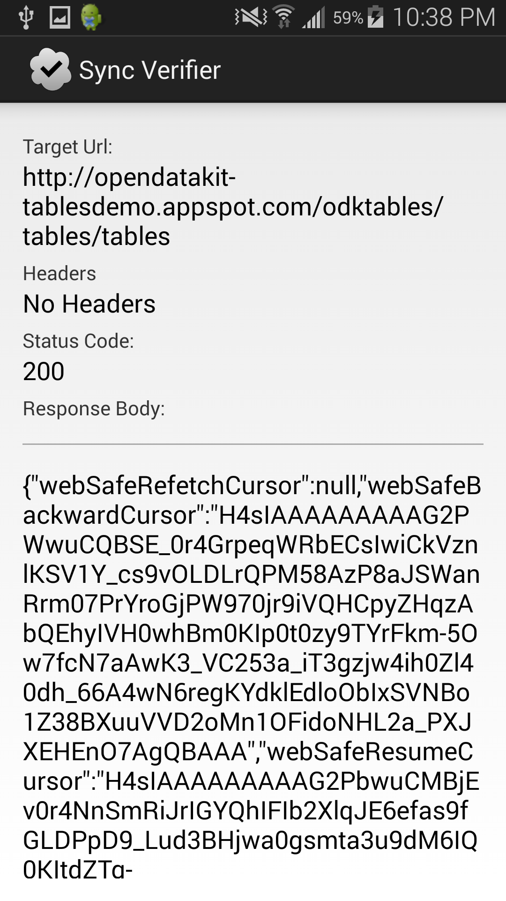
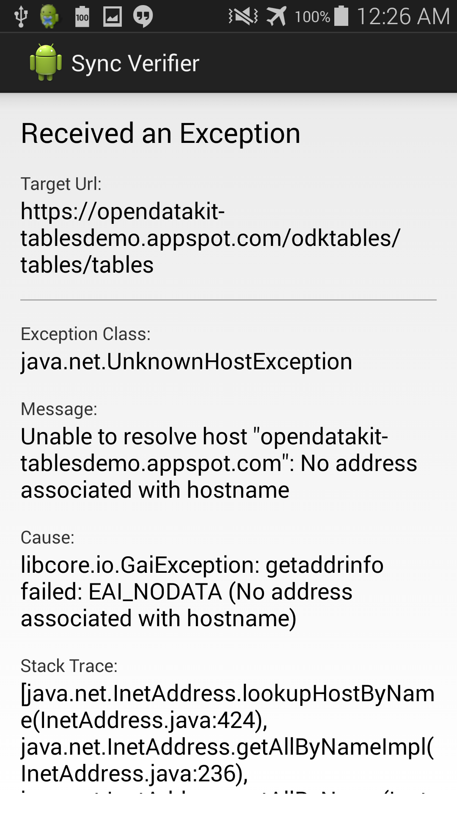

# SyncVerifier

> An API verifier for the ODK 2.0 REST protocol

## Overview

The [Open Data Kit](http://opendatakit.org/) 2.0 tools include the ability to
synchronize data with and ODK Aggregate server. A summary of the 2.0 tools can
be found
[here](http://opendatakit.org/2014/09/odk-2-0-alpha-rev-122-now-available/).

The tools are still in flux, and the UI is not yet as polished as it will be
when out of alpha/beta. For instance, if sync with the server fails, it can
currently be tricky to see exactly why.

This app allows you to perform authentication and query for a list of
available 2.0-style tables on the server, essentially pinging Aggregate to see
if things are configured correctly. The goal is that it will help debug issues
encountered during installation.

> Note! It currently lets you get an auth token, but does not actually pass
this along to the server. Thus it only allows the anonymous user. This will be
fixed.

## The App

The app lets you enter the url of your server (if you're using app engine, make
sure you don't forget to use `https://`!), choose a user (or perform no
authentication), authorize, and then try to retrieve a list of tables from the
server.

  

If the ping is successful, you will see the url, status code, and response
body.

  

In the case of an exception, information about the exception is provided to aid
in debuggin.

  

## Sync Protocol

More details on the ODK 2.0 REST protocol can be found
[here](https://code.google.com/p/opendatakit/wiki/REST_Synchronization_API).
